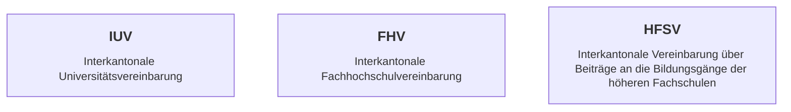

# Moderne TypeScript-Backends mit Nitro & Clean Architecture

Bärner JS Talks #26-1, 03.03.2026 \
Mathis Hofer, hofer@puzzle.ch

---
layout: center
transition: slide-up
---

<!--
- Wer ist vom Kanton Aargau und hat an einer Uni studiert?
- Excel-File mit allen Uni-Studenten seit den 1990er Jahren
-->

---
transition: slide-up
level: 3
---

<!--
- Bildung in der Schweiz Kantonal geregelt (ausser ETH/EPFL)
- Drei interkantonale Vereinbarungen unter dem Dach der EDK
- Regelung welcher Kanton ist Zahlungspflichtig wenn Student:innen ausserhalb ihres Kantons studieren
-->

---
transition: slide-up
level: 3
---

<!--
Aktuelle Situation:

- Uneinheitliche Formate von Schulen (Excel-Files, PDFs, Papier)
- Zeitintensive manuelle Verarbeitung
- Keine zentrale Datenbank
-->

---
transition: slide-up
level: 3
---

# Applikation: CORDEX

→ **C**ontrolling, **R**eporting, **D**ata, **Ex**change

TODO: Screenshots der Applikation

<!--
Applikation für Kanton Aargau entwickelt:

- Automatisierung der Kontrollen zur Zahlungspflicht
- Manuelle Prüfungen in schönem UI
- Zentrale Datenbank für Auswertungen & Prognosen
-->

---
layout: center
transition: slide-up
level: 3
---

<!--
- Veröffentlichung unter Open Source Lizenz
- CORDEX-Community: Nutzung durch weitere Kantone
- Beteiligung an Weiterentwicklungen, neue Features stehen allen zur Verfügung
- Aufteilung der Kosten anteilig
-->

---
layout: end
---

# Merci!

Fragen? Anregungen? \
[github.com/hupf/bernerjs-26-1](https://github.com/hupf/bernerjs-26-1)

<PoweredBySlidev mt-10 />
