# Moderne TypeScript-Backends <span class="highlight">mit Nitro & Clean Architecture</span>

Bärner JS Talks #26-1, 03.03.2026 \
Mathis Hofer \
hofer@puzzle.ch

---
layout: center
transition: slide-up
---


<!--
- Wer ist vom Kanton Aargau und hat an einer Uni studiert?
- Excel-File mit allen Uni-Studenten seit den 1990er Jahren
-->

---
transition: slide-up
level: 3
---


<!--
- Bildung in der Schweiz Kantonal geregelt (ausser ETH/EPFL)
- Drei interkantonale Vereinbarungen unter dem Dach der EDK
- Regelung welcher Kanton ist Zahlungspflichtig wenn Student:innen ausserhalb ihres Kantons studieren
-->

---
transition: slide-up
level: 3
---


<!--
Aktuelle Situation:

- Uneinheitliche Formate von Schulen (Excel-Files, PDFs, Papier)
- Zeitintensive manuelle Verarbeitung
- Keine zentrale Datenbank
-->

---
transition: slide-up
level: 3
---

# Applikation: CORDEX

**Co**ntrolling, **R**eporting, **D**ata, **Ex**change

<div class="flex gap-12 mt-12">
  
  
</div>

<style>
  img {
    width: 45%;
    box-shadow: rgba(0, 0, 0, 0.16) 0px 1px 4px;
  }
</style>

<!--
Applikation für Kanton Aargau entwickelt:

- Automatisierung der Kontrollen zur Zahlungspflicht
- Manuelle Prüfungen in schönem UI
- Zentrale Datenbank für Auswertungen & Prognosen
-->

---
layout: center
transition: slide-up
level: 3
---


<div style="position: absolute; bottom: 0.5em; font-size: 0.5em; opacity: 0.3;">CC BY-SA 4.0 publiccode.eu</div>

<!--
- Veröffentlichung unter Open Source Lizenz
- CORDEX-Community: Nutzung durch weitere Kantone
- Beteiligung an Weiterentwicklungen, neue Features stehen allen zur Verfügung
- Dies der Kontext des Talks (Erfahrungsbericht)
-->

---
layout: meet
transition: slide-up
level: 3
---

# Nice to meet you

::members::

<div>
  

Mathis Hofer

Software Engineer & Architect, \
Member of the Technical Board \
hofer@puzzle.ch

</div>

<!--
- Softwareentwickler bei Puzzle
- Webentwicklung seit ca. 25 Jahren
- Frontend-affin (Vertretung im Tech Board)
- Full Stack
  - Python/Django
  - Ruby on Rails
  - TypeScript
-->

---
layout: agenda
transition: slide-left
---

# Agenda

<Toc minDepth="2" maxDepth="2" />

---
layout: intro
transition: slide-up
level: 2
---

# REST Backend <span class="highlight">mit Nitro</span>

<!--
- Am Anfang stand die Frage: Was für eine Architektur?
-->

---
transition: slide-up
level: 3
hide: true
---

# Building Blocks

```mermaid
flowchart TB
  subgraph CORDEX
    frontend[Frontend]
    backend[Backend]
    worker[Worker]
    db[(Database)]
    storage[(Object Storage)]

    frontend -- "HTTP" --> backend
    backend -- "SQL" --> db
    backend -- "HTTP" --> storage
    worker -- "SQL" --> db
    worker -- "HTTP" --> storage

end

controller((👩‍💻<br>Controller))
user((👨‍💻<br>Read-only))
iam[IAM]
ers[ERS]
enfinio[Enfinio]

controller -- "HTTP" --> frontend
user -- "HTTP" --> frontend
backend -- "OAuth" --> iam
backend -.-> enfinio
worker -.-> enfinio
frontend -- "Link" --> ers
```

<div style="transform: scale(0.7); transform-origin: top left;">



</div>

---
layout: center
transition: slide-up
level: 3
---

# Was für eine Architektur?

<!--
- Erst Umsetzung mit Next.js/RSC geplant, dann für SPA + REST API entschieden
-->

---
transition: slide-up
level: 3
---

# Wieso SPA + REST API?

<div class="reasons mt-10">

  <div>
    
    <div>Interne<br>Businessapplikation</div>
  </div>

  <div>
    
    <div>Lange Session-Zeiten</div>
  </div>

  <div>
    
    <div>Gemischte Erfahrungen<br>mit RSCs</div>
  </div>

  <div>
    
    <div>Unbekannte<br>Betriebsumgebungen</div>
  </div>

  <div>
    
    <div>Externe<br>Weiterverarbeitung</div>
  </div>

  <div>
    
    <div>Etablierte Architektur</div>
  </div>

</div>

<style>
  .reasons {
    display: grid;
    grid-template-columns: repeat(3, 1fr);
    gap: 2rem;
  }

  .reasons > div {
    display: flex;
    flex-direction: column;
    align-items: center;
    text-align: center;
    gap: 0.5rem;
  }

  img {
    height: 100px;
  }
</style>

<!--
- Nicht öffentliche Businessapplikation \
  → Nur von Sachbearbeiter:innen verwendet
- Lange Session-Zeiten \
  → First Contentful Paint ist nicht kritisch
- Gemischte Erfahrungen mit Next.js und RSC/Server Actions
- Unbekannte Betriebsumgebungen bei den Kantonen \
  → Potentiell Probleme mit RSC Protokoll durch Proxies, WAFs, etc.
- Externe Weiterbearbeitung der Daten \
  → API erwünscht
- Architektur die wir gut kennen
-->

---
layout: full
transition: slide-up
level: 3
---


<!--
- Viele Wege führen nach Rom...
- Unzählige Server & Web Frameworks für JavaScript Runtimes
- Express Standard noch vor ein paar Jahren
- Von minimalen Server Toolkits (Express) bis zu Full-fledged Web Frameworks (NestJS, AdonisJS) à la Ruby on Rails
- Nitro als moderner Mittelweg
-->

---
transition: slide-up
level: 3
hide: true
---

# Tech Stack

<div class="flex gap-12" style="font-size: 0.8em">

<div>

#### Allgemein

- **PostgreSQL**
- S3-compatible **Object Storage**
- 100% **TypeScript**
- PNPM Workspace <span class="opacity-50">– Package manager & monorepo tool</span>
- Zod <span class="opacity-50">– Schema validation</span>
- Vitest <span class="opacity-50">– Unit & integration tests</span>
- ESLint <span class="opacity-50">– Linting</span>
- Prettier <span class="opacity-50">– Opiniated code formater</span>
- Kubernetes + Helm <span class="opacity-50">– Containerized deployment</span>
- GlitchTip <span class="opacity-50">– Error tracking</span>

</div>

<div>

#### Frontend

- Vite
- **React** <span class="opacity-50">– Frontend framework</span>
- TanStack Router <span class="opacity-50">– Client-side routing</span>
- TanStack Query <span class="opacity-50">– Data fetching</span>
- Carbon Design System <span class="opacity-50">– Component framework</span>
- Tailwind <span class="opacity-50">– Utility-first CSS framework</span>

#### Backend

- **Nitro**/H3 <span class="opacity-50">– Server toolkit</span>
- Kysely <span class="opacity-50">– Typesafe SQL query builder</span>
- FlyDrive <span class="opacity-50">– S3-compatible storage library</span>
- Brandi <span class="opacity-50">– Dependency injection</span>
- Arctic <span class="opacity-50">– Authentication</span>
- Graphile Worker <span class="opacity-50">– Asynchronous job queue</span>

</div>

</div>

<style>
  ul {
    list-style-type: none;
  }
  h4 + ul > li {
    margin: 0;
    padding: 0;
  }
  h4 {
    margin-bottom: 0.5em;
  }
  ul + h4 {
    margin-top: 1.5em;
  }
</style>

---
layout: iframe-right
url: https://nitro.build/
transition: slide-up
level: 3
---

# Nitro

- **TypeScript-native**
- **Runtime-agnostisch** \
  (Node.js, Deno, Bun, Edge, Serverless)
- Basiert auf H3 https://h3.unjs.io/
- **Zero Config Setup** \
  (Dev Server mit HMR, kompakter Build)
- **File-based Routing**
- Plugins & Middlewares
- Schöne Error Page bei Exceptions
- Auto Imports
- **Minimal, trotzem _(Some) Batteries Included™_**

https://nitro.build/

---
layout: iframe-right
url: https://unjs.io/relations?u[]=automd&u[]=bundle-runner&u[]=c12&u[]=changelogen&u[]=citty&u[]=confbox&u[]=consola&u[]=cookie-es&u[]=crossws&u[]=db0&u[]=defu&u[]=destr&u[]=fontaine&u[]=fs-memo&u[]=get-port-please&u[]=giget&u[]=h3&u[]=hookable&u[]=httpxy&u[]=image-meta&u[]=ipx&u[]=jimp-compact&u[]=jiti&u[]=knitwork&u[]=listhen&u[]=magic-regexp&u[]=magicast&u[]=mdbox&u[]=mkdist&u[]=mlly&u[]=mongoz&u[]=nanotar&u[]=nitropack&u[]=node-fetch-native&u[]=nypm&u[]=ofetch&u[]=ohash&u[]=pathe&u[]=perfect-debounce&u[]=pkg-types&u[]=radix3&u[]=rc9&u[]=scule&u[]=serve-placeholder&u[]=std-env&u[]=theme-colors&u[]=ufo&u[]=unbuild&u[]=uncrypto&u[]=unctx&u[]=undocs&u[]=unenv&u[]=unhead&u[]=unimport&u[]=unpdf&u[]=unplugin&u[]=unstorage&u[]=untun&u[]=untyped&u[]=unwasm&u[]=uqr&u[]=webpackbar&showDependencies=false&showDevDependencies=false&showChildren=false
transition: slide-up
level: 3
---

# Nitro, Nuxt und das UnJS Ökosystem

<span class="opacity-50 prose-sm" style="line-height: 0.8">November 2020</span> \
Initiale Arbeiten an «Nuxt Nitro» (bzw. H3) durch Pooya Parsa

<span class="opacity-50 prose-sm" style="line-height: 0.8">März 2021</span> \
UnJS Organisation auf GitHub

<span class="opacity-50 prose-sm" style="line-height: 0.8">November 2022</span> \
[Nuxt 3.0 mit Nitro](https://nuxt.com/blog/nuxt3-rc) als Server Engine

<span class="opacity-50 prose-sm" style="line-height: 0.8">Juni 2025</span> \
Nuxt 5.0 mit Nitro v3 und H3 v2 [angekündigt](https://nuxt.com/blog/roadmap-v4)

<span class="opacity-50 prose-sm" style="line-height: 0.8">Juli 2025</span> \
Nuxt(-Labs), Nitro (und Pooya Parsa) [von Vercel übernommen](ttps://vercel.com/blog/nuxtlabs-joins-vercel)

---
transition: slide-up
level: 3
---

# Nitro/H3 als Basis für Meta Frameworks

<div class="meta-frameworks mt-10">

  <div>
    
    <div>Nuxt <div class="framework">Vue</div></div>
  </div>

  <div>
    
    <div>Analog <div class="framework">Angular</div></div>
  </div>

  <div>
    
    <div>TanStack Start <div class="framework">React/Solid</div></div>
  </div>

  <div>
    
    <div>SolidStart <div class="framework">Solid</div></div>
  </div>

  <div>
    
    <div>Vinxi <div class="framework">Full Stack Framework SDK</div></div>
  </div>

</div>

<style>
  .meta-frameworks {
    display: grid;
    grid-template-columns: repeat(3, 1fr);
    gap: 2rem;
  }

  .meta-frameworks > div {
    display: flex;
    flex-direction: column;
    align-items: center;
    text-align: center;
    gap: 0.5rem;
  }

  .framework {
    font-size: 0.8em;
    opacity: 0.5;
  }

  img {
    height: 100px;
  }
</style>

<!--
→ Es gibt eine Community und ein Interesse an der Weiterentwicklung von Nitro.
-->

---
transition: slide-up
level: 3
---

# Nitro Build

Basierend auf Rollup (Nitro v2) bzw. Vite (Nitro v3)

Bundled und treeshaked den Server Code inkl. Dependencies:

```
$ nitro build
...
$ node .output/server/index.mjs
```

→ 🚀 `.output/` Directory in einen Node Container kopieren und los... \
→ ⚡️ Schnelle Cold Starts \
→ 😃 Keine `node_modules` in der Produktion!

---
transition: slide-up
level: 3
---

# Nitro Runtime Features

- Cache <span class="opacity-50">– Route- & Function-level Caching</span>
- KV Storage <span class="opacity-50">– Key-Value Storage mit verschiedenen Drivers wie Reddis, MongoDB</span>
- WebSocket
- `$fetch` <span class="opacity-50">– für interne & externe Abfragen</span>

Experimental:

- SQL Database <span class="opacity-50">– einfacher DB Layer</span>
- Tasks <span class="opacity-50">– rudimentäre Task-Runtime</span>
- OpenAPI <span class="opacity-50">– Swagger-basierte API Doku</span>

---
level: 3
transition: slide-up
---

# File-based Routing

`server/routes/hello/[name]/[age].ts`

```typescript
export default defineEventHandler((event) => {
  const name = getRouterParam(event, "name");
  const age = getRouterParam(event, "age");

  return `Hello ${name}! You are ${age} years old.`;
});
```

→ Use can use function composition!

---
layout: iframe-right
url: https://v3.nitro.build/
level: 3
---

# Nitro v3

- **Vite-basiert (Nitro v3 ist ein Vite Plugin)**
- Renderer mit rendu Hypertext Preprocessor
- Integration von weiteren Frameworks neben H3, wie Hono oder Elysia
- React Server Components Support
- ...

---
layout: intro
transition: slide-up
level: 2
---

# <div>Clean Architecture</div> <div>für <span class="highlight">pragmatische TypeScripters</span></div>

---
layout: image-right
image: ./images/clean-architecture-rings.svg
transition: fade
level: 3
---

# Was ist Clean Architecture?

- Kombiniert Prinzipien aus _Hexagonal Architecture_ und _Onion Architecture_
- **Separation of Concerns**
- Dependency Rule: **Abhängikeiten nur von aussen gegen innen** \
  <span class="opacity-50">→ Dependency Inversion Principle (DIP)</span>

<!--
- Domain Model & Domain Logik im Zentrum
- Anders als Layered Architectur wo Frameworks & Drivers die Basis sind: hier ganz aussen
- Adapters Schicht zwischen neutraler Domain und Frameworks & Drivers
- Dependency Rule
-->

---
layout: image-right
image: ./images/clean-architecture-rings2.svg
transition: slide-up
level: 3
---

# Was ist Clean Architecture?

- Kombiniert Prinzipien aus _Hexagonal Architecture_ und _Onion Architecture_
- **Separation of Concerns**
- Dependency Rule: **Abhängikeiten nur von aussen gegen innen** \
  <span class="opacity-50">→ Dependency Inversion Principle (DIP)</span>

<!--
- Problem: Use Cases verwenden Repositories & Services
- Lösung: Use Case definiert Interface, Repository/Gateway implementiert es → Implementation wird via Dependency Injection dem Use Case provided (Pfeil umgekehrt)
-->

---
layout: quote
transition: fade
level: 3
class: text-center
---

# Clean Architecture != Less Code

<!--
- Im Gegenteil: Sehr viel mehr Code/Boilerplate
- Entkoppelung hat ihren Preis
- Wie viel sind wir bereit zu «bezahlen» in unserem Projekt?
-->

---
transition: slide-up
level: 3
---


<!--
- Pragmatische Implementierung
- Hier Clean Architecture konkret für unser Projekt
-->

---
transition: slide-up
level: 3
---

# Monorepo Packages & Dependencies


---
transition: slide-up
level: 3
---

# Model


<<< @/snippets/model.ts

<!--
- Unser Domain Model = Zod Schemas
- TypeScript Type abgeleitet (gleicher Name)
-->

---
transition: slide-up
level: 3
---

# Controller


<<< @/snippets/route-handler.ts

<!--
- Controller = meistens Route Handler → wenn grösser eigene Klasse
- Auslesen von Query Params, Request Body etc.
- Use Case über DI
- Custom Route Handlers: Authorization & Validierung (Type-safe!)
-->

---
transition: slide-up
level: 3
---

# Service


<<< @/snippets/service.ts

<!--
- Trivial in diesem Beispiel
- Oft mehr Applikationslogik, mehrere Repositories etc.
-->

---
transition: slide-up
level: 3
---

# Repository


<div style="transform: scale(0.8); transform-origin: top left;">

<<< @/snippets/repository.ts

</div>

<!--
- Datenbank Zugriff mit Kysely (Type-safe SQL query builder)
- `db` Instanz auch über DI injected
-->

---
layout: quote
transition: slide-up
level: 3
---

# Moment mal...

---
transition: slide-up
level: 3
---

# Service


<<< @/snippets/service.ts {3,7,14}

<!--
- Repository Import zeigt in falsche Richtung!
- Nur type-Import, betrifft Implmentation von Service nicht
- Vernachlässigbare Koppelung
- Interfaces möglich wenn nötig
-->

---
transition: slide-up
level: 3
---

# Repository


<div style="transform: scale(0.8); transform-origin: top left;">

<<< @/snippets/repository.ts {2,14,25}

</div>

<!--
- Kysely Types leaken nicht in andere Schichten
- `toCamel` Type-safe von Snake Case zu Camel Case
- Verwendung von Zod Types global (auch im Frontend!)
- Nachteil Anpassung in ganzer App wenn DB Feld ändert → Vorteil!
-->

---
transition: slide-up
level: 3
---

<div style="transform: scale(0.7); transform-origin: top center;">


</div>

---
layout: quote
transition: fade
level: 3
class: text-center
---

# It is a trade-off...

<!--
- Schon Clean Architectur ist ein Trade-off
- Gerade mit TypeScript: pragmatische Mini-Trade-offs möglich
-->

---
layout: quote
transition: fade
level: 3
class: text-center
---

# 🤔 Clean Architecture?

---
layout: quote
level: 3
class: text-center
---

# Clean Architecture Spirit!

<!--
- Entkoppellung doch erreicht
- Massiv weniger Boilerplate
- Clean Architecture = Common Language (man kennt die Struktur mit Repositories & Services etc.)
-->

---
layout: end
---

# Merci!

Fragen? \
Slides: [github.com/hupf/bernerjs-26-1](https://github.com/hupf/bernerjs-26-1) <span class="text-xs">(CC BY-SA 4.0)</span> \
\
<span class="social"> <span>[@hupf@tooting.ch](https://tooting.ch/@hupf)</span></span><span class="social"> <span>[@hupf.bsky.social](https://bsky.app/profile/hupf.bsky.social)</span></span>

<PoweredBySlidev mt-10 />

<style>
  .social {
    display: flex;
    gap: 0.5em;
    margin-bottom: 0.3em;
    align-items: center;
  }
  .social img {
    width: 50px;
  }

</style>
